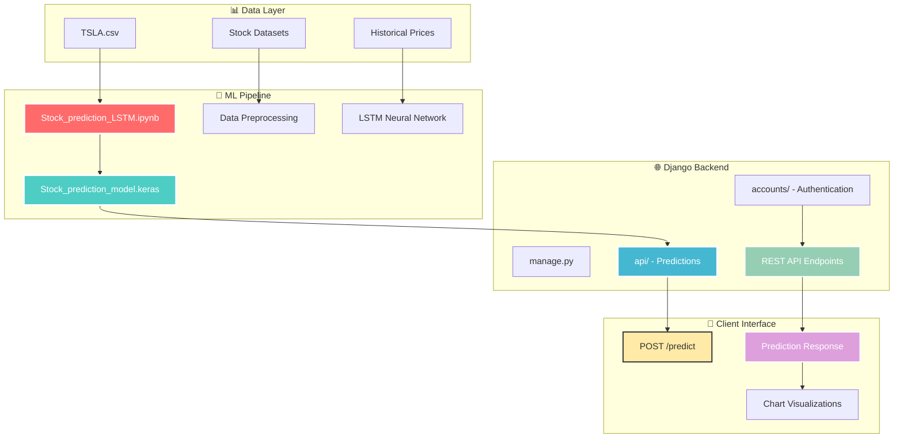

<div align="center">


# 📈 Stock Prediction Portal
### *LSTM Deep Learning • Django REST API • Real-time Predictions*


[](https://your-stock-portal.herokuapp.com)
[](#-api-endpoints)
[](#-installation)

</div>

---

## 🎯 Web-Based Stock Intelligence

<div align="center">

### LSTM Neural Networks Meet Django REST Framework

<table>
<tr>
<td align="center" width="140">
<br>
<strong>Historical Data</strong><br>
<sub>CSV datasets</sub>
</td>
<td align="center" width="140">
<br>
<strong>LSTM Training</strong><br>
<sub>Deep learning model</sub>
</td>
<td align="center" width="140">
<br>
<strong>Django Backend</strong><br>
<sub>REST API server</sub>
</td>
<td align="center" width="140">
<br>
<strong>Predictions</strong><br>
<sub>Real-time forecasts</sub>
</td>
<td align="center" width="140">
<br>
<strong>Visualizations</strong><br>
<sub>Interactive charts</sub>
</td>
</tr>
</table>

</div>

---

## 🏗️ System Architecture

<div align="center">



</div>

---

## 🚀 Quick Setup

<div align="center">

### Launch Your Stock Portal

<table>
<tr>
<td align="center" width="200">
<br>
<strong>1. Clone Repository</strong><br>
<code>git clone [repo-url]</code>
</td>
<td align="center" width="200">
<br>
<strong>2. Install Dependencies</strong><br>
<code>pip install -r requirements.txt</code>
</td>
<td align="center" width="200">
<br>
<strong>3. Run Django Server</strong><br>
<code>python manage.py runserver</code>
</td>
<td align="center" width="200">
<br>
<strong>4. Access API</strong><br>
<code>localhost:8000/api/</code>
</td>
</tr>
</table>

</div>

---

## 📊 Portal Features

<div align="center">

### Complete Stock Prediction Ecosystem

<table>
<tr>
<td align="center" width="300">
<br>
<strong>LSTM Neural Network</strong><br>
<sub>Trained keras model for price forecasting</sub><br>
📁 Stock_prediction_model.keras
</td>
<td align="center" width="300">
<br>
<strong>REST API Backend</strong><br>
<sub>Django REST Framework endpoints</sub><br>
🔗 POST /predict • GET /charts
</td>
</tr>
<tr>
<td align="center" width="300">
<br>
<strong>Authentication System</strong><br>
<sub>User registration & login management</sub><br>
🔐 accounts/ app
</td>
<td align="center" width="300">
<br>
<strong>Interactive Visualizations</strong><br>
<sub>Real-time stock price charts</sub><br>
📊 Matplotlib integration
</td>
</tr>
</table>

### Learning Resources Hub

<table>
<tr>
<td align="center" width="200">
<br>
<strong>LearnJupyter.ipynb</strong><br>
<sub>Notebook tutorials</sub>
</td>
<td align="center" width="200">
<br>
<strong>LearnMatplot.ipynb</strong><br>
<sub>Visualization guide</sub>
</td>
<td align="center" width="200">
<br>
<strong>LearnNumpy.ipynb</strong><br>
<sub>Data processing</sub>
</td>
</tr>
</table>

</div>

---

## 🛠️ Tech Stack

<div align="center">

### Production-Ready Technologies

<table>
<tr>
<td align="center" width="120">
<br>
<strong>Python</strong><br>
<sub>Core Language</sub>
</td>
<td align="center" width="120">
<br>
<strong>Django</strong><br>
<sub>Web Framework</sub>
</td>
<td align="center" width="120">
<br>
<strong>DRF</strong><br>
<sub>REST API</sub>
</td>
<td align="center" width="120">
<br>
<strong>Keras</strong><br>
<sub>Deep Learning</sub>
</td>
<td align="center" width="120">
<br>
<strong>Pandas</strong><br>
<sub>Data Analysis</sub>
</td>
</tr>
<tr>
<td align="center" width="120">
<br>
<strong>NumPy</strong><br>
<sub>Numerical Computing</sub>
</td>
<td align="center" width="120">
<br>
<strong>Matplotlib</strong><br>
<sub>Plotting & Charts</sub>
</td>
<td align="center" width="120">
<br>
<strong>Jupyter</strong><br>
<sub>Notebooks</sub>
</td>
<td align="center" width="120">
<br>
<strong>Scikit-learn</strong><br>
<sub>ML Preprocessing</sub>
</td>
<td align="center" width="120">
<br>
<strong>Git</strong><br>
<sub>Version Control</sub>
</td>
</tr>
</table>

</div>

---

## 📁 Project Structure Visualization

<div align="center">

```
🚀 Stock_Prediction_Portal_main/
│
└── 📂 Stock_Prediction_Portal-main/
    ├── 📋 .gitignore
    │
    ├── 📚 Resources/                        ← 🎓 Learning Hub
    │   ├── 📓 LearnJupyter.ipynb            ← 📖 Jupyter tutorials
    │   ├── 📊 LearnMatplot.ipynb            ← 📈 Plotting guide
    │   ├── 🔢 LearnNumpy.ipynb              ← 🧮 NumPy basics
    │   ├── 🧠 Stock_prediction_LSTM.ipynb   ← 🎯 Core ML Logic
    │   ├── 📈 TSLA.csv                      ← 🚗 Tesla dataset
    │   ├── 📞 call_activity.csv             ← 📊 Demo data
    │   └── 🚙 auto_sales_data.csv           ← 📊 Example data
    │
    └── 🌐 backend/                          ← 🏗️ Django Server
        ├── 🎯 manage.py                     ← 🚀 Django manager
        ├── 🤖 Stock_prediction_model.keras  ← 🧠 Trained LSTM
        │
        ├── 👤 accounts/                     ← 🔐 Authentication
        │   ├── 🏗️ models.py                 ← 👥 User models
        │   ├── 🎨 views.py                  ← 🔑 Auth views
        │   └── 📡 serializers.py            ← 🔄 Data marshalling
        │
        └── 🔮 api/                          ← 📊 Prediction API
            ├── 🏗️ models.py                 ← 📈 Prediction models  
            ├── 🎨 views.py                  ← 🤖 API endpoints
            ├── 🔧 utils.py                  ← 🛠️ Helper functions
            ├── 🔗 urls.py                   ← 🌐 URL routing
            └── 📡 serializers.py            ← 📊 JSON responses
```

</div>

---

## 🔗 API Endpoints

<div align="center">

### RESTful Stock Prediction API

<table>
<tr>
<td align="center" width="200">
<br>
<code>POST /api/predict</code><br>
<sub>🔮 Generate predictions</sub>
</td>
<td align="center" width="200">
<br>
<code>GET /api/charts</code><br>
<sub>📊 Fetch visualizations</sub>
</td>
<td align="center" width="200">
<br>
<code>POST /accounts/login</code><br>
<sub>🔑 User authentication</sub>
</td>
<td align="center" width="200">
<br>
<code>POST /accounts/register</code><br>
<sub>👤 User registration</sub>
</td>
</tr>
</table>

</div>

---

## 🎯 Commands & Usage

<div align="center">

<table>
<tr>
<td align="center" width="200">
<br>
<code>python manage.py runserver</code><br>
<sub>🚀 Start Django server</sub>
</td>
<td align="center" width="200">
<br>
<code>python manage.py migrate</code><br>
<sub>🗄️ Setup database</sub>
</td>
<td align="center" width="200">
<br>
<code>jupyter notebook</code><br>
<sub>📓 Open notebooks</sub>
</td>
<td align="center" width="200">
<br>
<code>python manage.py test</code><br>
<sub>🧪 Run tests</sub>
</td>
</tr>
</table>

</div>

---


## 🔗 Resources & References

<div align="center">

<table>
<tr>
<td align="center" width="150">
<br>
<a href="https://www.djangoproject.com/"><strong>Django Docs</strong></a><br>
<sub>Web framework guide</sub>
</td>
<td align="center" width="150">
<br>
<a href="https://www.django-rest-framework.org/"><strong>DRF Guide</strong></a><br>
<sub>REST API framework</sub>
</td>
<td align="center" width="150">
<br>
<a href="https://keras.io/"><strong>Keras Docs</strong></a><br>
<sub>Deep learning library</sub>
</td>
<td align="center" width="150">
<br>
<a href="https://jupyter.org/"><strong>Jupyter</strong></a><br>
<sub>Interactive notebooks</sub>
</td>
</tr>
</table>

</div>

## 📄 License

This project is licensed under the **MIT License** - see the [LICENSE](LICENSE) file for details.

```
MIT License

Permission is hereby granted, free of charge, to any person obtaining a copy
of this software and associated documentation files (the "Software"), to deal
in the Software without restriction...
```

## 📞 Support

<div align="center">

[](https://github.com/Ratan1103/Stock_Prediction_Portal/issues)
[](mailto:sanjayratan665@gmail.com)

</div>

If you have any questions, feel free to:
- 🐛 [Open an issue](https://github.com/Ratan1103/Stock_Prediction_Portal/issues)
- 📧 Send an email to `sanjayratan665@gmail.com`
- 💬 Start a discussion in the repository

---

</div>
